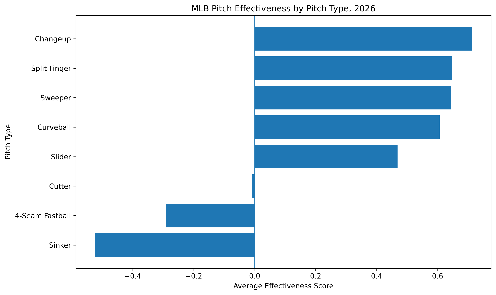
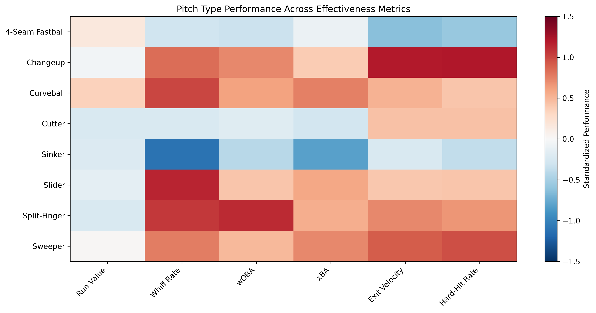

# MLB Pitch Effectiveness — 2026

**Sports Analytics · Python · MLB Statcast**

---

## Research Question

**Which MLB pitch types are most effective at limiting offensive production during the 2026 MLB season?**

Pitch effectiveness is important in baseball because pitchers use different pitch types to produce different outcomes against hitters. Understanding which pitches perform better across multiple measures can provide a broader view of pitching performance and player evaluation.

For this project, I analyzed 2026 MLB Statcast data to compare eight major pitch types and determine which types were most effective at limiting offensive production.

---

## Dataset

The data came from **MLB Statcast through Baseball Savant** and represents the **2026 MLB regular season through September 2, 2026**.

The raw Statcast dataset contained **576,199 unique pitches**. After limiting the data to regular-season games, there were **575,939 pitches**. After filtering to the eight pitch types used in this analysis, the final pitch-level dataset contained **559,722 pitches**.

The eight pitch types analyzed were:

* 4-Seam Fastball
* Sinker
* Slider
* Changeup
* Sweeper
* Cutter
* Curveball
* Split-Finger

The final analysis was performed at the **pitcher–pitch type level**, resulting in **535 observations**.

The main variables used included:

* Pitch type
* Pitcher
* Number of pitches
* Run value per 100 pitches
* Whiff rate
* wOBA
* Expected batting average (xBA)
* Average exit velocity
* Hard-hit rate

I also identified **97,327 valid batted-ball observations** using records that contained both launch speed and an events value.

I collected the publicly available Statcast data using accessible Baseball Savant CSV/statcast endpoints and divided the requests into date ranges to collect the 2026 season-to-date data. The data collection did not attempt to bypass access restrictions or access private information.

---

## Data Cleaning and Preparation

Several steps were used to prepare the data for analysis.

First, duplicate pitches were identified using the combination of `game_pk`, `at_bat_number`, and `pitch_number`. The data was then restricted to regular-season games using `game_type == "R"`.

Next, I filtered the dataset to the eight pitch types included in the research question. For exit velocity, I only considered valid batted-ball observations where both `launch_speed` and `events` were present.

I calculated average exit velocity for each pitcher and pitch type and merged those values with the Baseball Savant Pitch Arsenal data.

The final merged dataset contained **535 pitcher–pitch type observations**. Seven observations were missing average exit velocity, and all seven were curveball observations. I kept these observations rather than removing them or replacing the missing values with an estimate.

Because the metrics use different scales and have different meanings, I standardized each metric using a z-score before creating the Effectiveness Score.

---

## Conceptualization and Operationalization

I defined **pitch effectiveness** as how well a pitch limits offensive production across multiple performance measures.

The six measures used in the Effectiveness Score were:

* **Run value per 100 pitches:** Measures the run impact associated with a pitch. Lower values are better for pitchers.
* **Whiff rate:** Measures how often swings result in misses. Higher values are better for pitchers.
* **wOBA:** Measures opposing offensive production. Lower values are better for pitchers.
* **Expected batting average (xBA):** Estimates batting average based on quality of contact. Lower values are better for pitchers.
* **Average exit velocity:** Measures how hard hitters make contact. Lower values generally indicate better pitching performance.
* **Hard-hit rate:** Measures the percentage of batted balls hit at 95 mph or harder. Lower values are better for pitchers.

Because some metrics are better when they are lower, I reversed the direction of run value, wOBA, xBA, exit velocity, and hard-hit rate after standardization. Whiff rate was kept in its original direction because higher values indicate better pitching performance.

I then averaged the six standardized metrics to create an **Effectiveness Score**.

A positive score indicates above-average effectiveness compared with the other pitcher–pitch type observations in the dataset, while a negative score indicates below-average effectiveness.

The Effectiveness Score is a descriptive measure created for this project and is **not an official MLB statistic**. The research question was operationalized by comparing the average Effectiveness Score across the eight pitch types.

Research on baseball performance and advanced pitching data supports the use of multiple performance measures when evaluating pitchers (Watkins et al., 2021; LaPrade et al., 2022; Cinque et al., 2022).

---

## Results

The results show that pitch type is associated with differences in offensive production during the **2026 MLB season through September 2, 2026**.

Based on the Effectiveness Score, the **changeup was the most effective pitch type**, with an average score of **0.713**. The split-finger and sweeper followed closely behind with scores of **0.647** and **0.645**.

Curveballs and sliders also performed above the overall average, while cutters were close to average.

The **4-Seam Fastball** and **Sinker** had negative effectiveness scores, with the sinker ranking lowest at **-0.525**.

Overall, the results suggest that pitch types differ in their ability to limit offensive production when effectiveness is evaluated using multiple performance measures.

---

## Visualizations and Insights

### Average Effectiveness Score by Pitch Type

The chart compares the average Effectiveness Score for each pitch type. Changeups had the highest average score, while sinkers had the lowest.

The zero line represents the overall average, making it easier to identify pitch types that performed above or below average.

### Pitch Type Performance Heatmap

The heatmap shows how each pitch type performed across the individual metrics used to calculate the Effectiveness Score.

Changeups performed well across several measures, including whiff rate, wOBA, expected batting average, exit velocity, and hard-hit rate.

Sinkers had the lowest whiff rate at approximately **13.8%** and also had relatively high wOBA and expected batting average, which contributed to their lower overall effectiveness score.

Interestingly, sliders had the highest average whiff rate at approximately **35.2%**, but they did not rank first overall. This demonstrates why I used multiple measures instead of relying on a single statistic when evaluating pitch effectiveness.

---

## Sensitivity Analysis

To determine whether differences in pitch usage affected the results, I also calculated a **pitch-count weighted Effectiveness Score**.

The weighted rankings were very similar to the original results. The changeup remained first and the sinker remained last, while the sweeper and split-finger switched positions.

This suggests that the overall pattern was relatively stable after accounting for differences in pitch usage.

---

## Ethics and Limitations

The data used in this project came from publicly available baseball statistics and did not require access to private or sensitive personal information.

There are several limitations to the analysis.

First, the **2026 MLB season was still in progress** when the data was collected. The results may change as additional games are played.

Second, the pitch types had different numbers of observations and different usage levels. Some pitch types are used much more frequently than others, which can affect comparisons.

Third, seven pitcher–pitch type observations were missing average exit velocity. All seven were curveball observations. These observations were retained rather than removing them, so the Effectiveness Score for those observations was calculated using the available metrics.

Fourth, the Effectiveness Score is a custom measure created for this project. The equal weighting of the six metrics is a modeling decision and does not necessarily represent how MLB teams would value each metric.

Finally, this analysis shows **associations rather than causation**. Pitch performance can also be affected by pitcher skill, batter quality, pitch location, count, pitch sequencing, handedness, and game situation. Therefore, the results should not be interpreted as proof that a specific pitch type directly causes better or worse offensive outcomes.

---

## What I Learned and Next Steps

This project gave me experience collecting and cleaning real-world baseball data, working with pandas, creating visualizations, and combining multiple statistics into a single analytical measure.

One of the biggest challenges was deciding how to operationalize a broad concept like pitch effectiveness. Using multiple metrics helped provide a more complete picture than relying on one statistic.

If I continued this project, I would analyze **individual pitchers** to determine which pitchers are most effective with each pitch type. I would also examine pitch location, count, batter handedness, pitch velocity, spin rate, and pitch movement to better understand why certain pitches perform differently.

I would also repeat the analysis when the **2026 MLB season is complete** to determine whether the rankings remain consistent with a full season of data.

---

## Code and Transparency

**Direct code link:** [**View the full analysis code →**](https://github.com/tpitford/data-science-portfolio/blob/main/project_1_analysis.ipynb)

### Generative AI Disclosure

**Generative AI Tool:** OpenAI ChatGPT
**Version/Model:** GPT-5.6 Luna
**Purpose:** I used ChatGPT to troubleshoot Python code, explain programming errors, suggest approaches for cleaning and organizing the data, and revise portions of the written project.

### Data Source

MLB Statcast data accessed through Baseball Savant.

---

## References

Cinque, M. E., LaPrade, C. M., Abrams, G. D., Sherman, S. L., Safran, M. R., & Freehill, M. T. (2022). Ulnar collateral ligament reconstruction does not decrease spin rate or performance in Major League pitchers. *The American Journal of Sports Medicine, 50*(8), 2190–2198. https://doi.org/10.1177/03635465221097421

LaPrade, C. M., Cinque, M. E., Safran, M. R., Freehill, M. T., Wulf, C. A., & LaPrade, R. F. (2022). Using advanced data to analyze the impact of injury on performance of Major League Baseball pitchers: A narrative review. *Orthopaedic Journal of Sports Medicine, 10*(7), 23259671221111169. https://doi.org/10.1177/03635465221111169

Watkins, C., Berardi, V., & Rakovski, C. (2021). Pitcher effectiveness: A step forward for in game analytics and pitcher evaluation. *Mathematics and Sports, 2*(1), 1–8. https://doi.org/10.5149/ms.1226
