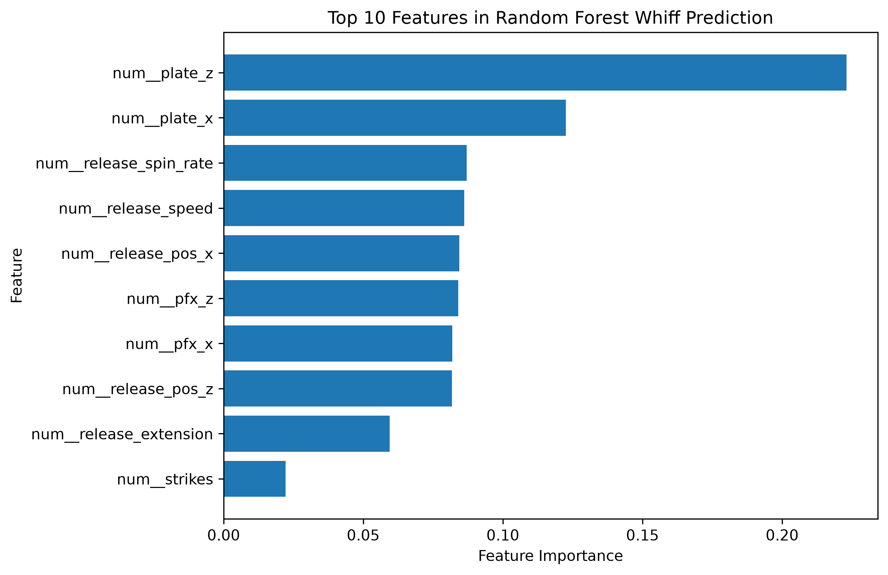
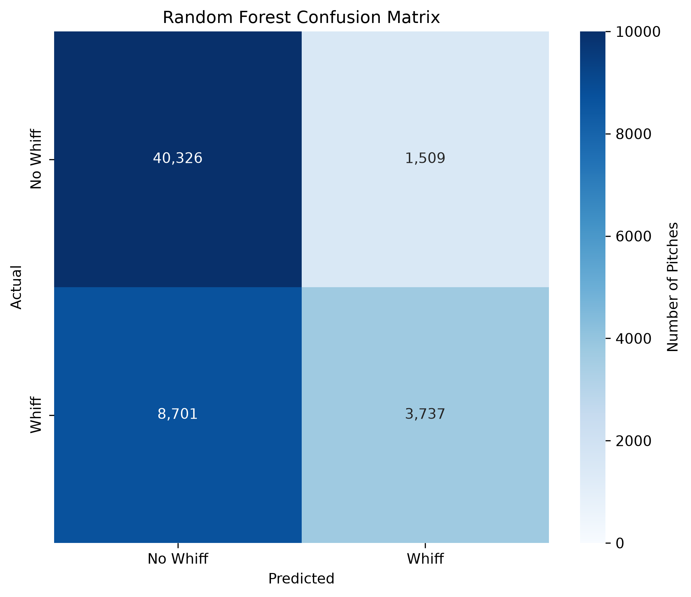

# MLB Whiff Prediction — 2026

**Sports Analytics · Python · Machine Learning · MLB Statcast**

---

## Problem Definition

**Research Question:** Among MLB pitches that batters swing at, can pitch characteristics and game context predict whether the swing will result in a whiff?

A whiff occurs when a batter swings at a pitch and misses. Predicting whiffs can provide insight into which pitch characteristics and game situations are associated with swings and misses.

For this project, I used 2026 MLB Statcast data to build machine learning models that predict whether an individual swing will result in a whiff. The project compares a baseline model, Logistic Regression, and Random Forest to evaluate how well Statcast pitch characteristics can predict the outcome.

---

## Background and Context

Statcast provides pitch-level tracking data for Major League Baseball, including measurements such as pitch velocity, spin rate, pitch movement, release position, and release extension. MLB describes Statcast as a system that tracks and measures pitching, hitting, fielding, and player movement throughout Major League games.

These measurements are useful for studying swings and misses because pitch characteristics can affect how a pitch moves and reaches the plate. For example, MLB defines spin rate as the amount of spin on the baseball at release and explains that spin can affect the trajectory of a pitch. Statcast also measures horizontal and vertical pitch movement, allowing pitch characteristics to be quantified rather than evaluated only through observation.

Previous research has also demonstrated the value of using Statcast data for baseball performance analysis. Watkins et al. (2021) developed a pitcher-effectiveness measure using Statcast data and showed how pitch-level information can be used for performance evaluation. Kagan and Nathan (2017) discussed Statcast's ability to provide detailed measurements that can be used to analyze baseball trajectories and performance.

This project applies that general idea to a specific prediction problem: determining whether measurable pitch characteristics and game context can help predict whether a batter's swing will result in a whiff. The goal is not to claim that any individual feature causes a whiff, but to determine whether these features contain useful predictive information.

---

## Dataset Description

The data came from **MLB Statcast through Baseball Savant** and represents the **2026 MLB regular season through September 2, 2026**.

The unit of analysis is an **individual pitch that resulted in a swing**. I limited the dataset to normal swing outcomes, including fouls, foul tips, balls put into play, and swinging strikes.

After filtering the data, there were **272,163 usable swings**. The target variable, `whiff`, was created as a binary variable:

* **1 = Whiff:** swinging strike or swinging strike blocked
* **0 = No Whiff:** foul, foul tip, or ball put into play

The final modeling dataset contained **271,362 observations** after removing rows with missing values in the selected predictor variables.

The predictor variables included:

* Pitch type
* Release speed
* Release spin rate
* Horizontal pitch movement
* Vertical pitch movement
* Release position
* Release extension
* Horizontal plate location
* Vertical plate location
* Balls
* Strikes
* Batter handedness
* Pitcher handedness

The target variable was moderately imbalanced. Approximately **77.1% of swings were classified as non-whiffs and 22.9% were classified as whiffs**.

---

## Data Cleaning and Preparation

Several steps were used to prepare the Statcast data for machine learning.

First, I limited the dataset to pitch descriptions representing normal swings. Bunts and pitchouts were excluded because they represent different types of batting actions and could make the prediction problem less consistent.

I then created the binary `whiff` target using the Statcast pitch description. Swinging strikes and swinging strikes that were blocked were classified as whiffs. Fouls, foul tips, and pitches hit into play were classified as non-whiffs.

The selected predictor variables were checked for missing values. A total of **801 observations were removed** because at least one selected predictor was missing. This represented approximately **0.3% of the usable swing observations**.

Categorical variables such as pitch type, batter handedness, and pitcher handedness were one-hot encoded. Numerical variables were standardized using `StandardScaler`.

The preprocessing steps were placed inside a scikit-learn pipeline so that transformations were learned using only the training data. This helped prevent information from the test set from being used during model training.

---

## Data Understanding and Exploration

The target variable was not evenly distributed across the dataset. Of the 272,163 swings before removing observations with missing predictor values, 77.1% were non-whiffs and 22.9% were whiffs. This class imbalance is important because a model could achieve relatively high accuracy by predicting the majority class most of the time. For this reason, I used precision, recall, F1 score, and ROC-AUC in addition to accuracy when evaluating the models.

The numerical summary statistics also provided information about the typical characteristics of the pitches in the dataset. The average release speed was 89.83 mph, the average release spin rate was 2,260 rpm, and the average release extension was 6.44 feet. The average horizontal and vertical plate locations were approximately 0.02 feet and 2.30 feet, respectively. Balls ranged from 0 to 3 and strikes ranged from 0 to 2, representing the count at the time of the pitch.

Some variables contained unusual or extreme observations. For example, release speed ranged from 30.6 to 105.5 mph, while release spin rate ranged from 15 to 3,599 rpm. These extreme values were treated as potential outliers rather than automatically removed because an extreme observation does not necessarily mean that the Statcast measurement is invalid. Removing observations without a documented domain-based rule could also remove legitimate pitches. The final models therefore used the available observations after removing rows with missing values in the selected predictors.

The distribution of swing outcomes also showed that fouls and balls put into play were much more common than swinging strikes. The most common swing outcome was a foul, followed by a pitch hit into play. Swinging strikes and swinging strikes that were blocked represented the whiff class.

The predictor variables included both pitch characteristics and game context. Pitch speed, spin rate, pitch movement, release position, extension, and plate location describe characteristics of the pitch itself. Balls, strikes, batter handedness, and pitcher handedness provide additional information about the situation in which the pitch was thrown.

These findings informed the feature-selection process. I selected variables that were available at or before the pitch outcome and could reasonably provide predictive information about whether a swing would result in a whiff. Variables such as the original Statcast `description`, `events`, exit velocity, and launch angle were excluded because they contain information about the outcome of the pitch and could cause data leakage. The selected features therefore focus on pitch characteristics and game context rather than information revealed after the outcome occurred.

---

## Baseline and Model Development

I split the dataset into training and testing sets using an **80/20 split**. The split was stratified by the target variable so that the proportion of whiffs and non-whiffs remained similar in both sets. A `random_state` of 42 was used to make the results reproducible.

The baseline model was a **most-frequent classifier**. This model always predicts the majority class, which in this dataset was non-whiff. The baseline achieved an accuracy of **77.08%** on the test set.

I then trained two classification models: **Logistic Regression** and **Random Forest**.

### Logistic Regression

Logistic Regression was used as the first machine learning model because it provides a simple classification approach and establishes a useful comparison with the more complex Random Forest model.

The Logistic Regression model achieved:

* **Accuracy:** 77.98%
* **Precision:** 94.21%
* **Recall:** 4.19%
* **F1 Score:** 8.02%
* **ROC-AUC:** 0.6534

The model had very high precision, but its recall was low. This means that when the model predicted a whiff, it was usually correct, but it identified only a small percentage of the actual whiffs.

### Random Forest

The second model was a **Random Forest Classifier** with 100 decision trees. Random Forest was selected because it can capture nonlinear relationships and interactions between predictor variables that a linear model may not capture as effectively.

The Random Forest model achieved:

* **Accuracy:** 81.19%
* **Precision:** 71.24%
* **Recall:** 30.05%
* **F1 Score:** 42.26%
* **ROC-AUC:** 0.7745

The Random Forest produced higher accuracy, recall, F1 score, and ROC-AUC than Logistic Regression. Although its precision was lower, it identified substantially more of the actual whiffs in the test set.

---

## Model Evaluation and Selection

The three approaches were compared using accuracy, precision, recall, F1 score, and ROC-AUC.

| Model               | Accuracy | Precision | Recall | F1 Score | ROC-AUC |
| ------------------- | -------: | --------: | -----: | -------: | ------: |
| Baseline            |   77.08% |         — |      — |        — |       — |
| Logistic Regression |   77.98% |    94.21% |  4.19% |    8.02% |  0.6534 |
| Random Forest       |   81.19% |    71.24% | 30.05% |   42.26% |  0.7745 |

The baseline provided a useful reference because it predicted every swing as a non-whiff. Logistic Regression improved slightly over the baseline in accuracy, but its low recall meant that it identified very few of the actual whiffs.

The Random Forest produced the strongest overall predictive performance among the models tested. It had the highest accuracy, recall, F1 score, and ROC-AUC. Its recall of **30.05%** means that it correctly identified about 30% of the actual whiffs in the test set.

For this project, I selected the **Random Forest as the final model** because it provided a better balance between identifying whiffs and maintaining overall classification performance. The results also show why accuracy alone would not have been sufficient for evaluating this problem. The baseline achieved 77.08% accuracy simply by predicting the majority class, while the Random Forest was able to identify substantially more whiffs.

---

## Model Interpretation and Insights

The Random Forest model relied most heavily on pitch location and pitch characteristics when predicting whether a swing would result in a whiff. The most important feature was `plate_z`, which represents the vertical location of the pitch as it crossed the plate. `plate_x`, representing horizontal pitch location, was the second most important feature. Release spin rate, release speed, release position, and pitch movement were also among the most influential features.

The feature importance results suggest that where a pitch reaches the plate and how the pitch moves and is delivered provide useful information for predicting whiffs. However, feature importance should not be interpreted as evidence that these variables directly cause a batter to miss. Instead, the values show which features the Random Forest relied on most when making its predictions.

### Top 10 Random Forest Features

The chart above shows the ten features with the highest importance values in the Random Forest model. Pitch location, release characteristics, and pitch movement were among the most influential predictors.

The confusion matrix also shows where the model performed well and where it struggled. The model correctly classified **40,326 non-whiffs** and **3,737 whiffs**. It incorrectly classified **1,509 non-whiffs as whiffs** and missed **8,701 actual whiffs**.

### Random Forest Confusion Matrix

The relatively large number of missed whiffs is consistent with the model's recall of **30.05%**, meaning it identified about 30% of the actual whiffs in the test set.

Overall, the model found meaningful predictive patterns in the Statcast data, particularly in pitch location and pitch characteristics. However, the model does not perfectly distinguish between whiffs and non-whiffs. The results should therefore be viewed as evidence that Statcast pitch characteristics can provide predictive information rather than as a complete explanation of why a particular swing results in a whiff.

---

## Ethics and Limitations

The data used in this project came from publicly available MLB Statcast data and did not require access to private or sensitive personal information.

There are several limitations to this analysis.

First, the data represents the **2026 MLB regular season through September 2, 2026**, rather than the completed season. The results could change as additional games are played.

Second, the target variable was moderately imbalanced, with approximately **77.1% non-whiffs and 22.9% whiffs**. This means accuracy alone could give an incomplete picture of model performance. For this reason, I also considered precision, recall, F1 score, and ROC-AUC.

Third, approximately **0.3% of the usable swing observations were removed because of missing predictor values**. Removing these observations simplified the modeling process but means those pitches were not represented in the final models.

Fourth, the model does not include every factor that can influence whether a batter misses a pitch. Batter and pitcher skill, pitch sequencing, previous pitches, batter approach, game situation, and other contextual factors could affect the outcome.

The model also made **8,701 false-negative predictions**, meaning actual whiffs were classified as non-whiffs. This shows that the model should not be treated as a perfect predictor.

In a real baseball setting, a model like this could potentially be used as an additional analytical tool for evaluating pitch characteristics. However, model predictions should be considered alongside other statistical information and baseball expertise rather than being used as the sole basis for player evaluation or decision-making.

Finally, the model identifies statistical patterns rather than proving causation. Feature importance indicates which variables the Random Forest relied on when making predictions, but it does not mean that those variables directly cause a whiff.

---

## What I Learned and Next Steps

This project gave me experience building an end-to-end machine learning classification project using real-world MLB Statcast data. I gained experience with data cleaning, feature selection, preprocessing, model development, evaluation metrics, and interpreting machine learning results.

One of the biggest challenges was defining the prediction problem in a way that avoided data leakage. Because the goal was to predict whether a swing would result in a whiff, variables that directly described the outcome of the pitch could not be used as predictors.

Another important lesson was that accuracy alone does not fully describe model performance. The baseline achieved 77.08% accuracy by always predicting the majority class, while the Random Forest improved accuracy to 81.19% and identified more actual whiffs. Looking at multiple evaluation metrics provided a more complete understanding of the model's performance.

If I continued this project, I would experiment with hyperparameter tuning and cross-validation to determine whether the Random Forest could be improved. I would also investigate additional features such as pitcher and batter identity, pitch sequencing, inning, outs, and additional game context.

I would also test the model on a future portion of the season or a separate season to determine how well the patterns generalize beyond the data used in this project.

---

## Code and Transparency

**Direct code link:** [**View the full analysis notebook →**](project2.ipynb)

The complete analysis, including data preparation, exploratory analysis, model development, evaluation, and visualizations, is available in the Jupyter Notebook.

### Generative AI Disclosure

**Generative AI Tool:** OpenAI ChatGPT
**Version/Model:** GPT-5.6 Luna
**Purpose:** I used ChatGPT to explain machine learning concepts, troubleshoot Python code, help interpret model results, and revise portions of the written project. I reviewed and tested the code and results before including them in the final project.

---

## References

Baseball Savant. (n.d.). *Statcast*. MLB Advanced Media. https://baseballsavant.mlb.com/

Kagan, D., & Nathan, A. M. (2017). Statcast and the baseball trajectory calculator. *The Physics Teacher, 55*(3), 134–136. https://doi.org/10.1119/1.4976652

Kato, M., & Yanai, T. (2026). Are typical fastballs for a given throwing arm angle easier to hit? A game analysis of US Major League Baseball. *International Journal of Performance Analysis in Sport*. https://doi.org/10.1177/17479541251378897

MLB. (n.d.). *Statcast glossary*. MLB Advanced Media. https://www.mlb.com/glossary/statcast

Watkins, C., Berardi, V., & Rakovski, C. (2021). Pitcher effectiveness: A step forward for in game analytics and pitcher evaluation. *Mathematics and Sports, 2*(1), 1–8. https://doi.org/10.5149/ms.1226

